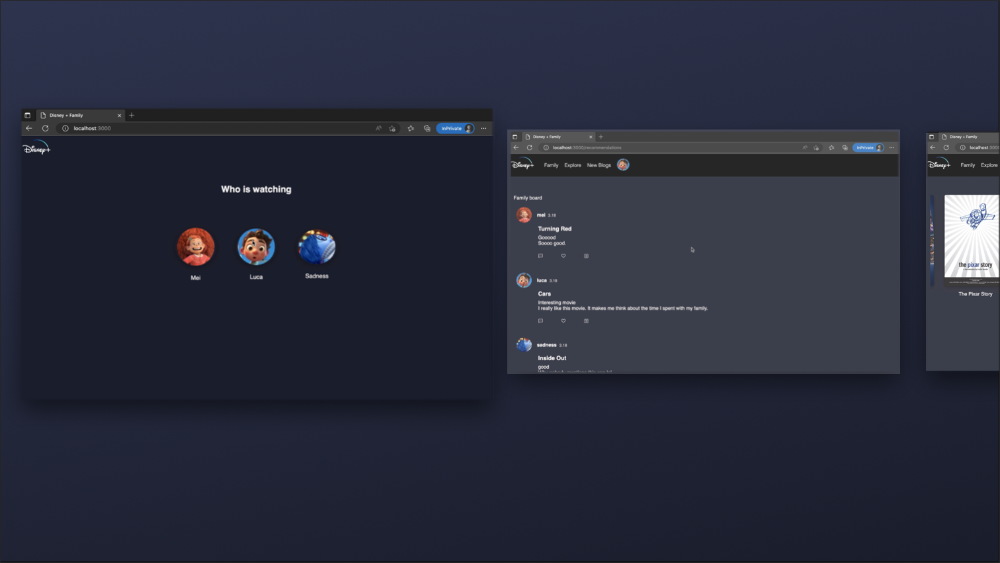
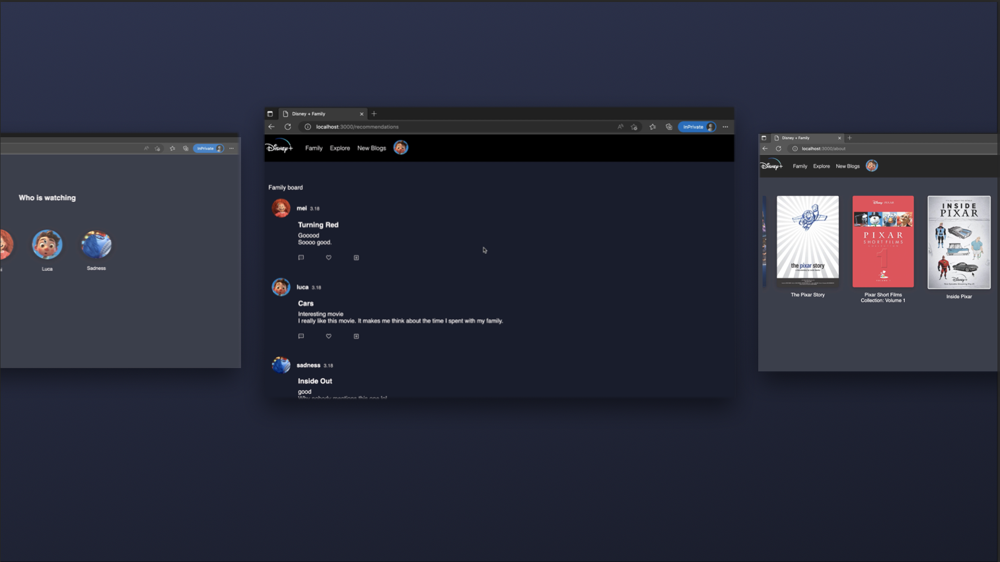
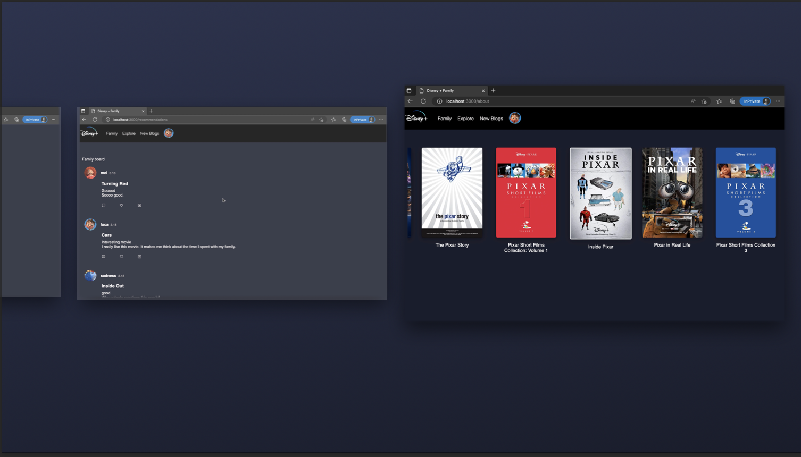

# DisneyFamilyFavorites

This project is based on Disney plus to build a platform for members in the same account to recommend and share their favorite movies to their families.

- Login Page

- Message Area

- Explore movies

[demo video](https://youtu.be/Jq1RBOwMIoM)

## Project introduction

- This is a side project to create a server using Node.js to host a website creating by Express, JavaScript, and MongoDB(NoSQL).
- The tool that integrates into this project including EJS view engines to improve execution performance, development time, and maintain clean code.
- Utilize IMDb movie api from RapidAPI to fetch the movie data and display in client-end.

## Resource

- Images: The images used in this project are All Creative Commons images
- Icons: [Google Fonts](https://fonts.google.com/icons)
- The design of the website is based on Disney Plus
- Movie API: Rapid API IMDb
